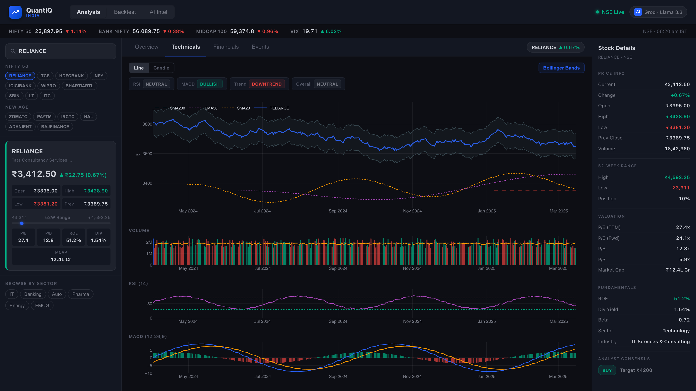
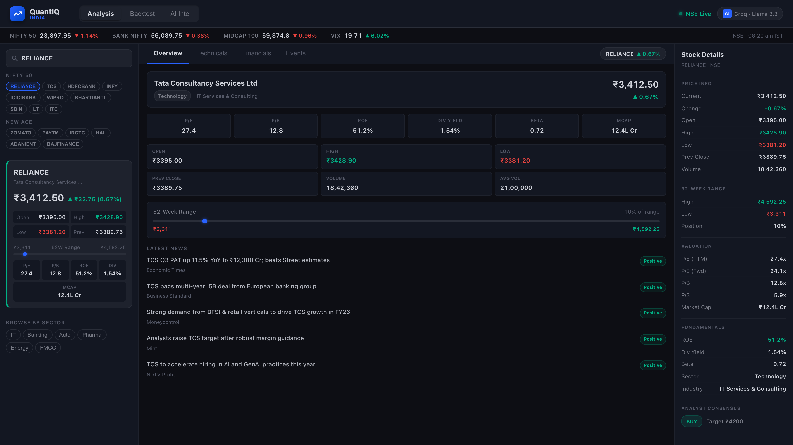

# QuantIQ India

A professional Indian equity market analysis and event-driven backtesting platform. Search any NSE stock, get live prices, technical indicators, financials, and run AI-powered event-driven backtests — all with **no paid API keys required for market data**.


<p align="center">


</p>

---

## Features

### Analysis Tab
- Live NSE quotes via the NSE unofficial API (30-second refresh)
- OHLC, volume, 52-week range with position indicator
- P/E, P/B, ROE, dividend yield, market cap in Crores
- Latest news with VADER sentiment badges (Positive / Neutral / Negative)
- Analyst consensus and target price

### Technicals Tab
- 1-year candlestick or line chart with SMA 20/50/200 overlays
- Bollinger Bands (20-period, 2σ)
- RSI (14), MACD (12, 26, 9), Volume with MA20
- Signal badges: RSI state · MACD direction · Trend · Overall composite

### Financials Tab
- Quarterly Revenue & PAT bar charts in ₹ Crore
- Annual Revenue & PAT (last 4 fiscal years)
- Key ratios table: P/E, P/B, ROE, Debt/Equity, EPS, margins

### Events Tab
- Upcoming earnings season, RBI MPC meeting dates, Union Budget
- Actual historical RBI MPC dates (2022–2025) for accurate backtesting

### Backtest Tab
- Event types: Quarterly Results, RBI Policy, Union Budget, Dividend
- Entry/exit window sliders (1–10 days)
- Stop-loss and take-profit toggles
- Preset strategies: Conservative / Aggressive / Multi-Event
- Metrics: Win rate, Avg return, Sharpe, Sortino, Max drawdown, VaR 95%, Profit factor
- Cumulative return chart, per-event bar chart, individual trade scatter

### AI Intel Tab (requires free Groq key)
- **Strategy Chat**: Streaming conversation with Llama 3.3 70B with full backtest context
- **Research Agent**: Multi-step agentic pipeline — fundamentals → news sentiment → technicals → trade thesis with Overall Score and Signal
- Understands Indian market context: RBI stance, FII/DII flows, SEBI, NSE/BSE, ₹ formatting, Indian fiscal year

### Market Bar
- Live NIFTY 50, BANK NIFTY, MIDCAP 100, VIX from NSE's own indices API

---

## Data Sources

| Source | What it provides | API Key? |
|--------|-----------------|----------|
| NSE unofficial API | Live quotes, indices | None |
| yfinance (.NS suffix) | Historical OHLCV, fundamentals, news | None |
| Groq (Llama 3.3 70B) | AI chat, narrative, research agent | Free at console.groq.com |

Market data fetching priority:
1. NSE API for live price (30-s TTL)
2. yfinance `fast_info` for 52-week range, market cap
3. yfinance `t.info` for fundamentals (cached 1 hr to avoid rate limits)
4. Graceful partial-data fallback: app always shows price even if fundamentals are delayed

---

## Quick Start

### Prerequisites
- Python 3.11+
- Node.js 18+

### 1. Clone

```bash
git clone https://github.com/Utsavd7/QuantIQ.git
cd QuantIQ
```

### 2. Environment variables

```bash
cp .env.example .env
```

Open `.env` and add your free Groq key (get one at [console.groq.com](https://console.groq.com) — no credit card):

```env
GROQ_API_KEY=gsk_your_key_here
```

Market data (NSE + yfinance) requires **no API key**.

### 3. Backend

```bash
cd backend
python -m venv venv
source venv/bin/activate      # Windows: venv\Scripts\activate
pip install -r requirements.txt
uvicorn app:app --reload --port 8000
```

### 4. Frontend

```bash
cd frontend
npm install
npm start
```

Open [http://localhost:3000](http://localhost:3000).

---

## API Reference

### Market Data
| Method | Endpoint | Description |
|--------|----------|-------------|
| GET | `/api/indices` | Live NIFTY 50, BANK NIFTY, MIDCAP 100, VIX |
| GET | `/api/stock/{ticker}` | Quote + fundamentals + news |
| GET | `/api/technicals/{ticker}` | OHLCV + SMA/MACD/RSI/BB signals |
| GET | `/api/financials/{ticker}` | Quarterly/annual P&L in ₹ Cr |
| GET | `/api/search?q={query}` | Symbol/name search |
| GET | `/api/sector/{sector}` | Stocks in IT/Banking/Auto/etc. |
| WS  | `/ws/{ticker}` | WebSocket live price stream |

### Backtest
| Method | Endpoint | Description |
|--------|----------|-------------|
| POST | `/api/backtest` | Run event-driven backtest |

```json
{
  "ticker": "RELIANCE",
  "event_types": ["earnings", "rbi"],
  "window_before": 2,
  "window_after": 3,
  "stop_loss": 0.05,
  "take_profit": 0.10
}
```

### AI (requires GROQ_API_KEY)
| Method | Endpoint | Description |
|--------|----------|-------------|
| POST | `/api/ai/chat` | Streaming chat (SSE) |
| POST | `/api/ai/backtest-narrative` | One-shot backtest analysis |
| GET  | `/api/ai/research/{ticker}` | Agentic research pipeline (SSE) |

---

## Strategy Metrics

| Metric | Formula |
|--------|---------|
| Return | `(Exit − Entry) / Entry` |
| Sharpe | `√252 × (mean(R) − 6.5%) / std(R)` |
| Sortino | `√252 × (mean(R) − 6.5%) / downside_std(R)` |
| Max Drawdown | `min((cumR − runningMax) / runningMax)` |
| VaR 95% | `5th percentile of return distribution` |
| Profit Factor | `Σ wins / |Σ losses|` |

Risk-free rate is **6.5%** (Indian 10-year G-Sec yield).

---

## Project Structure

```
.
├── backend/
│   ├── app.py               # FastAPI routes
│   ├── indian_market.py     # NSE/yfinance data layer, event dates
│   ├── ai_service.py        # Groq streaming chat + research agent
│   ├── ml_signals.py        # RandomForest + GMM regime detection
│   └── requirements.txt
├── frontend/
│   └── src/
│       ├── components/
│       │   ├── Dashboard.js     # Layout + data fetching
│       │   ├── LeftPanel.js     # Search, price card, backtest controls
│       │   ├── CenterPanel.js   # Overview/Technicals/Financials/Backtest tabs
│       │   ├── RightPanel.js    # Stats sidebar
│       │   └── AIPanel.js       # Chat + Research Agent
│       └── api.js
└── .env.example
```

---

## Supported Tickers

Any NSE-listed stock by symbol (e.g. `RELIANCE`, `TCS`, `ZOMATO`). Common aliases are also handled:

| Input | Resolves to |
|-------|------------|
| `SBI` | `SBIN` |
| `L&T` | `LT` |
| `HUL` | `HINDUNILVR` |
| `KOTAK` | `KOTAKBANK` |
| `AIRTEL` | `BHARTIARTL` |

NIFTY 50 quick-picks and sector browser (IT, Banking, Auto, Pharma, Energy, FMCG) available in the left panel.

---

## Disclaimer

For educational and research purposes only. Not financial advice. Past backtest performance does not guarantee future results.
