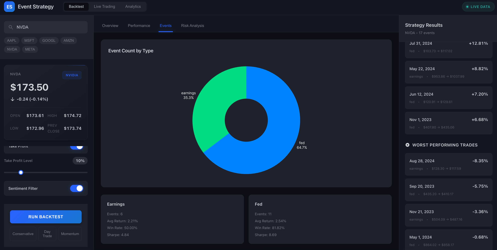
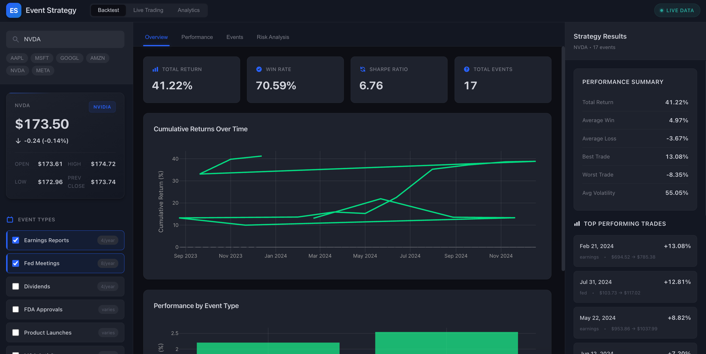

# Event-Driven Trading Strategy Simulator 📈

A professional-grade quantitative backtesting platform with real-time market data integration, designed for analyzing event-driven trading strategies. Built with React, FastAPI, and modern financial APIs.


## 🌟 Features

### Core Functionality
- **Real-Time Market Data**: Live price updates via WebSocket connections
- **Multi-Event Backtesting**: Test strategies across earnings, Fed meetings, dividends, FDA approvals, product launches, and M&A events
- **Risk Management**: Configurable stop-loss and take-profit orders
- **Sentiment Analysis**: Integration with news and social media sentiment
- **Professional UI**: Bloomberg Terminal-inspired dark theme with responsive design

### Technical Features
- **High-Performance Backtesting**: Vectorized calculations using NumPy/Pandas
- **Multiple Data Sources**: Finnhub, Tiingo, Alpha Vantage, Polygon.io integration
- **WebSocket Support**: Real-time price streaming
- **Caching System**: Redis-based caching for API optimization
- **Error Handling**: Graceful fallbacks and comprehensive error management

## 📸 Screenshots

<p align="center">


</p>

## 📊 Mathematical Formulas

### 1. **Return Calculation**
```
Total Return = (Exit Price - Entry Price) / Entry Price

Where:
- Entry Price = Close price at (Event Date - Window Before)
- Exit Price = Close price at (Event Date + Window After)
```

### 2. **Sharpe Ratio**
```
Sharpe Ratio = √252 × (Mean(Returns) - Risk-Free Rate) / StdDev(Returns)

Where:
- 252 = Trading days per year
- Risk-Free Rate = 0.02 (2% annual)
```

### 3. **Sortino Ratio** (Penalizes downside volatility only)
```
Sortino Ratio = √252 × (Mean(Returns) - Risk-Free Rate) / Downside Deviation

Where:
- Downside Deviation = StdDev(Returns[Returns < 0])
```

### 4. **Maximum Drawdown**
```
Max Drawdown = Min((Cumulative Return - Running Maximum) / Running Maximum)

Where:
- Cumulative Return = Product(1 + Daily Returns)
- Running Maximum = Maximum value up to current point
```

### 5. **Value at Risk (VaR) - 95% Confidence**
```
VaR₉₅ = 5th Percentile of Return Distribution
```

### 6. **Conditional Value at Risk (CVaR)**
```
CVaR₉₅ = Mean(Returns | Returns ≤ VaR₉₅)
```

### 7. **Profit Factor**
```
Profit Factor = Sum(Positive Returns) / |Sum(Negative Returns)|
```

### 8. **Win Rate**
```
Win Rate = Count(Returns > 0) / Total Count(Returns)
```

### 9. **Volatility (Annualized)**
```
Volatility = StdDev(Daily Returns) × √252
```

## 🚀 Quick Start

### Prerequisites
- Python 3.9+
- Node.js 16+
- Redis (optional, for caching)

### 1. Clone the Repository
```bash
git clone https://github.com/yourusername/event-strategy-simulator.git
cd event-strategy-simulator
```

### 2. Set Up Environment Variables
Copy the example environment file and add your API keys:

```bash
cp .env.example .env
```

Edit `.env` with your API keys:

```env
# Required API Keys (all have free tiers)
FINNHUB_API_KEY=your_finnhub_key_here
TIINGO_API_KEY=your_tiingo_key_here

# Optional but Recommended
ALPHA_VANTAGE_KEY=your_alpha_vantage_key
POLYGON_API_KEY=your_polygon_key
NEWS_API_KEY=your_newsapi_key
REDDIT_CLIENT_ID=your_reddit_client_id
REDDIT_CLIENT_SECRET=your_reddit_secret

# Optional - Alternative Data Sources
IEX_CLOUD_KEY=your_iex_key
```

### 3. Backend Setup
```bash
cd backend
python -m venv venv

# Windows
venv\Scripts\activate

# Mac/Linux
source venv/bin/activate

# Install dependencies
pip install -r requirements.txt

# Run the server
uvicorn app:app --reload --port 8000
```

### 4. Frontend Setup
```bash
# In a new terminal
cd frontend
npm install
npm start
```

The application will open at `http://localhost:3000`

## 🔧 Configuration Options

### Strategy Parameters
- **Event Types**: `earnings`, `fed`, `dividend`, `fda`, `product_launch`, `merger`
- **Window Before**: Days to enter position before event (1-10)
- **Window After**: Days to exit position after event (1-10)
- **Stop Loss**: Optional percentage stop loss (0-20%)
- **Take Profit**: Optional percentage take profit (0-50%)
- **Sentiment Filter**: Filter trades by news sentiment threshold

### Preset Strategies
1. **Conservative**: Single event type, moderate windows, no stop/take profit
2. **Day Trade**: Multiple events, tight windows, aggressive risk management
3. **Momentum**: Extended windows with sentiment filtering

## 🔌 API Endpoints

### REST Endpoints
- `GET /` - Health check
- `GET /api/live/{ticker}` - Get live quote and company info
- `POST /api/backtest` - Run backtest with parameters
- `GET /api/events/{ticker}` - Get historical events
- `GET /api/sentiment/{ticker}` - Get current sentiment

### WebSocket
- `WS /ws/{ticker}` - Real-time price updates

### Request Example
```json
POST /api/backtest
{
  "ticker": "AAPL",
  "event_types": ["earnings", "fed"],
  "window_before": 2,
  "window_after": 3,
  "use_sentiment": true,
  "sentiment_threshold": 0.1,
  "stop_loss": 0.05,
  "take_profit": 0.10
}
```

## 📈 Data Sources

### Free Tier Limits
1. **Finnhub** (60 calls/min) - Real-time quotes, earnings calendar
2. **Tiingo** (500 calls/hour) - Historical prices
3. **Alpha Vantage** (5 calls/min) - Backup price data
4. **NewsAPI** (100 calls/day) - News sentiment
5. **Polygon** (5 calls/min) - Market data

### Data Priority
1. Try Finnhub first (best free tier)
2. Fall back to Tiingo for historical data
3. Use Alpha Vantage as backup
4. Mock data for development/testing

## 🎨 UI Features

### Professional Trading Interface
- **Dark Theme**: Bloomberg Terminal-inspired design
- **Real-Time Updates**: Live price ticker with WebSocket
- **Interactive Charts**: Plotly.js visualizations
- **Responsive Design**: Mobile and tablet optimized
- **Accessibility**: WCAG compliant with keyboard navigation

### Key Components
1. **Ticker Search**: Autocomplete with popular symbols
2. **Price Display**: Real-time quote with daily stats
3. **Strategy Builder**: Visual configuration interface
4. **Results Dashboard**: Performance metrics and trade analysis
5. **Risk Analytics**: Drawdown, VaR, and Sharpe visualization

## 🧪 Testing

### Run Tests
```bash
# Backend tests
cd backend
pytest tests/

# Frontend tests
cd frontend
npm test
```

### Performance Benchmarks
- Backtest 2 years of data: ~2-3 seconds
- WebSocket latency: <100ms
- UI render time: <16ms (60 FPS)

## 🚨 Error Handling

### Common Issues

1. **No Data Returned**
   - Check API keys in `.env`
   - Verify ticker symbol is valid
   - Check rate limits

2. **WebSocket Connection Failed**
   - Ensure backend is running on port 8000
   - Check CORS settings
   - Verify WebSocket URL

3. **Slow Performance**
   - Enable Redis caching
   - Reduce backtest period
   - Check API rate limits

## 📚 Advanced Usage

### Custom Event Types
Add new event types in `backend/backtest.py`:

```python
def _get_custom_events(self, ticker, start_date, end_date):
    # Your custom event logic
    return [{'date': '2024-01-15', 'type': 'custom'}]
```

### Extend Risk Metrics
Add new metrics in `calculate_metrics()`:

```python
# Example: Calmar Ratio
calmar_ratio = annual_return / abs(max_drawdown)
```

### Custom Data Sources
Implement new provider in `data_provider.py`:

```python
def get_custom_data(ticker):
    # Your data fetching logic
    return price_data
```

## 🤝 Contributing

1. Fork the repository
2. Create feature branch (`git checkout -b feature/AmazingFeature`)
3. Commit changes (`git commit -m 'Add AmazingFeature'`)
4. Push to branch (`git push origin feature/AmazingFeature`)
5. Open Pull Request

## 📄 License

This project is licensed under the MIT License - see the LICENSE file for details.

## 🙏 Acknowledgments

- Financial data provided by Finnhub, Tiingo, Alpha Vantage
- UI inspired by Bloomberg Terminal and TradingView
- Built for quantitative finance education and research


---

**Disclaimer**: This software is for educational purposes only. Not financial advice. Always do your own research before making investment decisions.